# Zenith

<div align="center">

  
  
  
  
  
  

</div>

**Zenith** is a high-performance, visual interface for tracking humanity's presence in the cosmos. It combines real-time orbital tracking of Low Earth Orbit (LEO) satellites with a deep-space network monitor for interplanetary missions.

## Table of Contents

- [Tech Stack](#tech-stack)
- [Features](#features)
  - [Space Intelligence Dashboard](#space-intelligence-dashboard)
  - [Orbital Radar (LEO)](#orbital-radar-leo)
  - [Space Weather (Aurora)](#space-weather-aurora)
  - [Deep Space Network (DSN)](#deep-space-network-dsn)
  - [Launch Gateway](#launch-gateway)
- [Architecture & Data Flow](#architecture--data-flow)
- [Setup](#setup)
- [Automation](#automation)
  - [1. NASA JPL Horizons (Deep Space)](#1-nasa-jpl-horizons-deep-space)
  - [2. CelesTrak (LEO Satellites)](#2-celestrak-leo-satellites)
  - [3. Launch Library 2 (The Space Devs)](#3-launch-library-2-the-space-devs)
  - [4. NOAA Aurora Forecast](#4-noaa-aurora-forecast)
  - [5. AI Intelligence Agent](#5-ai-intelligence-agent)

## Tech Stack

- **Engine:** React 19, TypeScript
- **Build:** Vite 7
- **Styling:** Tailwind CSS v4
- **Runtime:** Bun

## Features

### Space Intelligence Dashboard
- **AI-curated daily overview** of the most significant space events.
- **Top 3 Events**: Launches, aurora opportunities, and satellite events ranked by importance.
- **Quick Stats**: Next launch countdown, current Kp index, weekly statistics.
- **Active Alerts**: Time-sensitive notifications for exceptional events.
- **Smart Navigation**: Click events to navigate directly to detailed views.

### Orbital Radar (LEO)
- Real-time tracking of the **ISS**, **Tiangong**, and **Starlink** constellations.
- **Azimuth/Elevation projection** relative to your location.
- Visual pass predictions and sky plotting.

### Space Weather (Aurora)
- **Real-time Kp Index** monitoring from NOAA Space Weather Prediction Center.
- **3-Day Aurora Forecast** with hourly Kp predictions.
- **Location-based visibility** thresholds (automatically calculates if aurora is visible at your latitude).
- **Observer Location**: Set your location via GPS or search.

### Deep Space Network (DSN)
- Tracking of legendary interstellar probes: **Voyager 1**, **Voyager 2**, **New Horizons**, and **James Webb**.
- **Real-Time Data**: Positions (Distance, Velocity, RA/DEC) fetched directly from **NASA JPL Horizons**.
- **Dual Visualization Modes**:
    - **Linear Scale**: Logarithmic distance timeline.
    - **Radial Map (2D)**: Polar plot showing the solar system scale and spacecraft directions relative to Earth.
- **Ping Simulation**: Visualizes the light-speed communication delay.

### Launch Gateway
- Countdown to the next major space launches worldwide.
- Detailed mission profiles including rocket configurations, launch sites, and mission descriptions.
- Data provided by **The Space Devs (Launch Library 2)**.

## Architecture & Data Flow

Zenith uses a hybrid approach to ensure performance and data freshness without hitting rate limits on client-side keys.

```mermaid
graph TD
    NASA[NASA JPL Horizons API]
    DSN[NASA DSN XML]
    CelesTrak[CelesTrak API]
    LL2[Launch Library 2 API]
    NOAA[NOAA SWPC API]
    OpenAI[OpenAI GPT-4.1]
    
    Script_Horizons[scripts/fetch-spacecraft.ts]
    Script_TLE["bash (curl)"]
    Script_Launches[scripts/fetch-launches.ts]
    Script_Aurora[scripts/fetch-aurora.ts]
    Script_Agent[agents/zenith-intelligence-agent.ts]
    
    JSON_Spacecraft[public/data/spacecraft.json]
    TXT_TLE[public/data/tles.txt]
    JSON_Launches[public/data/launches.json]
    JSON_Aurora[public/data/aurora.json]
    JSON_Insights[public/data/daily-insights.json]
    
    App[React Application]
    Action_Horizons["GitHub Action: update-spacecraft.yml"]
    Action_TLE["GitHub Action: update-tle.yml"]
    Action_Launches["GitHub Action: update-launches.yml"]
    Action_Aurora["GitHub Action: update-aurora.yml"]
    Action_Agent["GitHub Action: run-agent.yml"]

    subgraph "Automated Backend (Build Time)"
    Action_Horizons -- "Every 6h" --> Script_Horizons
    Script_Horizons -- "Queries (RA/DEC/Range)" --> NASA
    NASA -- "CSV Response" --> Script_Horizons
    
    Script_Horizons -- "Check Status" --> DSN
    DSN -- "XML Response" --> Script_Horizons
    
    Script_Horizons -- Writes --> JSON_Spacecraft

    Action_TLE -- Every 6h --> Script_TLE
    Script_TLE -- Fetches GP Elements --> CelesTrak
    CelesTrak -- TLE Response --> Script_TLE
    Script_TLE -- Writes --> TXT_TLE

    Action_Launches -- "Every 30m" --> Script_Launches
    Script_Launches -- "Queries" --> LL2
    LL2 -- "JSON Response" --> Script_Launches
    Script_Launches -- Writes --> JSON_Launches

    Action_Aurora -- "Every 6h" --> Script_Aurora
    Script_Aurora -- "Queries Kp Forecast" --> NOAA
    NOAA -- "JSON Response" --> Script_Aurora
    Script_Aurora -- Writes --> JSON_Aurora

    Action_Agent -- "Every 12h" --> Script_Agent
    Script_Agent -- Reads --> JSON_Launches
    Script_Agent -- Reads --> JSON_Aurora
    Script_Agent -- "Analyzes & Enriches" --> OpenAI
    OpenAI -- "AI Insights" --> Script_Agent
    Script_Agent -- Writes --> JSON_Insights
    end

    subgraph "Frontend (Runtime)"
    App -- Fetches --> JSON_Spacecraft
    App -- Fetches --> TXT_TLE
    App -- Fetches --> JSON_Launches
    App -- Fetches --> JSON_Aurora
    App -- Fetches --> JSON_Insights
    App -- Renders --> UI[UI / Canvas]
    end
```



## Setup

This project uses **Bun** as the package manager and runtime.

```bash
# Install dependencies
bun install

# Start development server
bun start

# Build for production
bun run build
```

## Automation

The project includes custom scripts and workflows to bridge external data sources.

### 1. NASA JPL Horizons (Deep Space)
- **Source**: `scripts/fetch-spacecraft.ts` queries **NASA Horizons** for ephemeris and **NASA DSN XML** for real-time signal status.
- **Schedule**: Updates every 6 hours via `update-spacecraft.yml`.
- **Output**: `public/data/spacecraft.json`.

### 2. CelesTrak (LEO Satellites)
- **Source**: `update-tle.yml` uses `curl` to fetch General Perturbation (GP) elements for "Visual" and "Stations" groups.
- **Schedule**: Updates every 6 hours.
- **Output**: `public/data/tles.txt` (Local mirror to prevent rate-limiting).

### 3. Launch Library 2 (The Space Devs)
- **Source**: `scripts/fetch-launches.ts` queries the **Launch Library 2** API for upcoming orbital launches.
- **Schedule**: Updates every 30 minutes via `update-launches.yml`.
- **Output**: `public/data/launches.json`.

### 4. NOAA Aurora Forecast
- **Source**: `scripts/fetch-aurora.ts` queries the **NOAA SWPC** for 3-day Kp index forecasts.
- **Schedule**: Updates every 6 hours via `update-aurora.yml`.
- **Output**: `public/data/aurora.json`.

### 5. AI Intelligence Agent
- **Source**: `agents/zenith-intelligence-agent.ts` uses **OpenAI GPT-4.1** to analyze space data.
- **Schedule**: Runs every 12 hours via `run-agent.yml`.
- **Capabilities**:
  - Analyzes upcoming launches and rates importance (1-10 scale)
  - Evaluates aurora forecasts and identifies optimal viewing windows
  - Generates daily summaries with top 3 events
  - Creates time-sensitive alerts for exceptional events
- **Output**: `public/data/daily-insights.json`, `public/data/enriched-launches.json`.
- **Configuration**: Set `OPENAI_API_KEY` and `MODEL_NAME` in environment variables.
