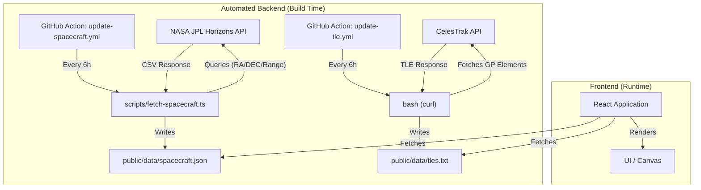

# Zenith

**Zenith** is a high-performance, visual interface for tracking humanity's presence in the cosmos. It combines real-time orbital tracking of Low Earth Orbit (LEO) satellites with a deep-space network monitor for interplanetary missions.

## Table of Contents

- [Tech Stack](#tech-stack)
- [Features](#features)
  - [Orbital Radar (LEO)](#orbital-radar-leo)
  - [Deep Space Network (DSN)](#deep-space-network-dsn)
- [Architecture & Data Flow](#architecture--data-flow)
- [Setup](#setup)
- [Automation](#automation)
  - [1. NASA JPL Horizons (Deep Space)](#1-nasa-jpl-horizons-deep-space)
  - [2. CelesTrak (LEO Satellites)](#2-celestrak-leo-satellites)

## Tech Stack

- **Engine:** React 19, TypeScript
- **Build:** Vite 7
- **Styling:** Tailwind CSS v4
- **Runtime:** Bun

## Features

### Orbital Radar (LEO)
- Real-time tracking of the **ISS**, **Tiangong**, and **Starlink** constellations.
- **Azimuth/Elevation projection** relative to your location.
- Visual pass predictions and sky plotting.

### Deep Space Network (DSN)
- Tracking of legendary interstellar probes: **Voyager 1**, **Voyager 2**, **New Horizons**, and **James Webb**.
- **Real-Time Data**: Positions (Distance, Velocity, RA/DEC) fetched directly from **NASA JPL Horizons**.
- **Dual Visualization Modes**:
    - **Linear Scale**: Logarithmic distance timeline.
    - **Radial Map (2D)**: Polar plot showing the solar system scale and spacecraft directions relative to Earth.
- **Ping Simulation**: Visualizes the light-speed communication delay.

## Architecture & Data Flow

Zenith uses a hybrid approach to ensure performance and data freshness without hitting rate limits on client-side keys.



## Setup

This project uses **Bun** as the package manager and runtime.

```bash
# Install dependencies
bun install

# Start development server
bun start

# Build for production
bun run build
```

## Automation

The project includes custom scripts and workflows to bridge external data sources.

### 1. NASA JPL Horizons (Deep Space)
- **Source**: `scripts/fetch-spacecraft.ts` queries NASA Horizons for accurate RA/DEC and Distance.
- **Schedule**: Updates every 6 hours via `update-spacecraft.yml`.
- **Output**: `public/data/spacecraft.json`.

### 2. CelesTrak (LEO Satellites)
- **Source**: `update-tle.yml` uses `curl` to fetch General Perturbation (GP) elements for "Visual" and "Stations" groups.
- **Schedule**: Updates every 6 hours.
- **Output**: `public/data/tles.txt` (Local mirror to prevent rate-limiting).
